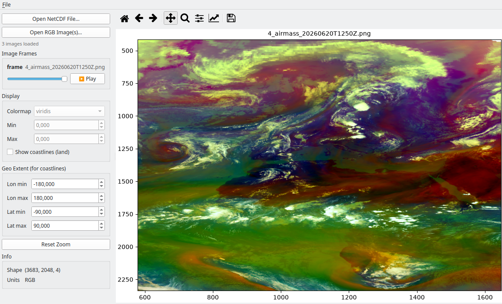
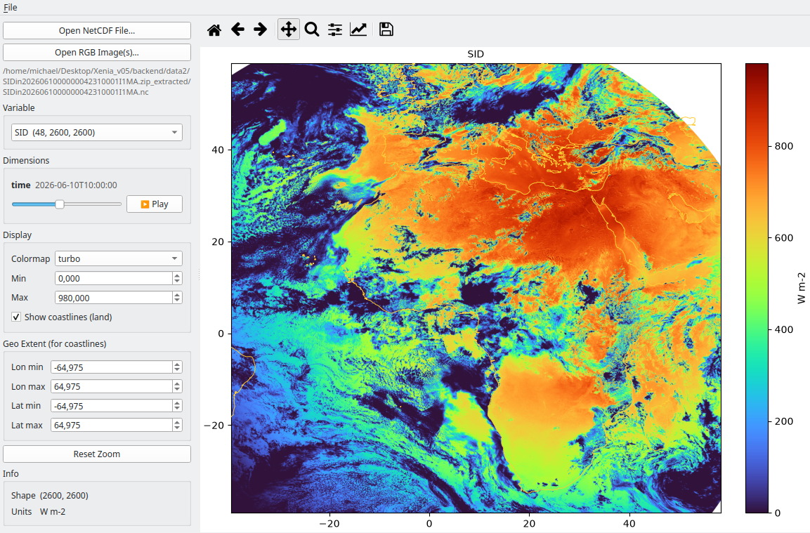

# Iris

A small, native desktop viewer for NetCDF / gridded scientific data, built
with **PySide6**. Load a `.nc` file, pick a variable, render it as a 2D field
with a colorbar — no browser involved.

Companion project to [Xenia](https://github.com/mixstam1821/Xenia), but
where Xenia is a FastAPI + MapLibre browser app, Iris (as a lightweight Xenia) is a genuine desktop
GUI application: real `QMainWindow`, menus, threading, embedded matplotlib
canvas.




## Why this exists

Most of my visualization work (Xenia, ERMES, FancyClima) is browser-based.
Iris is deliberately the opposite: a compact, from-scratch PySide6 app to
demonstrate actual desktop GUI development — window/menu/toolbar structure,
signals & slots, background threading so the UI never freezes on file I/O,
and embedding matplotlib inside Qt.

## Features

- Open any NetCDF file via `File → Open` or the sidebar button
- Auto-detects all 2D+ variables in the file
- **N-D variable support**: for any variable with extra dimensions beyond
  the spatial grid (time, level, ensemble member, ...), Iris builds controls
  automatically:
  - a **time**-like dimension gets a slider plus a ▶ Play / ⏸ Pause button
    that animates through it
  - any other extra dimension gets a dropdown of its coordinate values
    (e.g. pressure levels), or plain indices if the file has no coordinate
    variable for it
- Colormap picker (viridis, plasma, coolwarm, turbo, etc.)
- Adjustable min/max color scale
- **RGB image mode** (`File → Open RGB Image(s)…`): load one or more
  pre-rendered RGB(A) rasters — e.g. MTG true-color / natural-color PNGs
  exported from [Xenia](https://github.com/mixstam1821/Xenia) — and view
  them the same way as a NetCDF field. Loading several files at once turns
  them into "frames" you can step through or animate with the same
  slider + ▶ Play/⏸ Pause pattern used for a time dimension.
- **Land-only coastlines**: an optional overlay of Natural Earth "land"
  polygons (land/sea boundary only — no borders, rivers, or lakes), drawn
  on top of either a NetCDF field or an RGB image. For regular lat/lon
  NetCDF grids the geographic extent is auto-detected; for RGB images
  (which carry no embedded geo-referencing) you set the lon/lat extent by
  hand in the "Geo Extent" panel. Requires `cartopy` + `shapely`.
- **Zoom**: scroll-wheel zoom centered on the cursor, plus matplotlib's
  native toolbar (pan, rectangle-zoom, home, save-as-image) above the plot,
  and a "Reset Zoom" button in the sidebar. The current zoom level is
  preserved across time-slider steps, animation frames, and image frames —
  it only resets when you actually switch to a different dataset/extent.
- File inspection and slice loading run on background `QThread`s, so large
  files never freeze the window; rapid slider drags are handled with a
  request-id guard so only the latest requested slice is ever drawn
- Status bar feedback + graceful error dialogs on bad files

## Project structure

```
iris/
├── main.py               # entry point
├── iris/
│   ├── main_window.py    # QMainWindow: layout, menus, signal/slot wiring
│   ├── worker.py         # QThread workers for non-blocking file I/O
│   └── canvas.py         # matplotlib FigureCanvasQTAgg embedded in Qt
├── make_sample_data.py   # generates a synthetic sample_field.nc to try immediately
├── requirements.txt
└── README.md
```

## Setup

```bash
python -m venv venv
source venv/bin/activate   # Windows: venv\Scripts\activate

pip install -r requirements.txt
```

`cartopy` pulls in GEOS/PROJ; on Linux you may need `libgeos-dev`/`proj-bin`
system packages first (`apt install libgeos-dev proj-bin` on Debian/Ubuntu)
if pip's wheel doesn't cover your platform. Coastlines are optional — the
rest of the app works fine without cartopy/shapely installed, the checkbox
just won't do anything until they're available.

## Try it

Generate two small synthetic NetCDF files (no real data needed to test the app):

```bash
python make_sample_data.py
```

This writes:
- `sample_field.nc` — plain 2D `temperature` / `cloud_fraction`, to try the
  variable switcher, colormap, and zoom.
- `sample_field_nd.nc` — `temperature(time, level, lat, lon)` and
  `cloud_fraction(time, lat, lon)`, to try the dimension controls: a level
  dropdown, and a time slider with Play/Pause.

Then launch:

```bash
python main.py
```

`File → Open` and pick either file. To open your own data, any standard
NetCDF file works — variables can have any number of leading dimensions
(time, level, ensemble member, ...) before the final two spatial dims.

## Packaging as a standalone executable

Once you're happy with it, `pyinstaller` will bundle it into a single
double-click executable for Windows/Linux/macOS:

```bash
pip install pyinstaller
pyinstaller --name Iris --windowed --onefile main.py
```

The resulting binary will be in `dist/`.

## Notes on the architecture

- **Threading pattern**: workers are plain `QObject`s moved to a `QThread`
  via `moveToThread`, not `QThread` subclasses — this is the pattern Qt's
  own docs recommend, since it keeps thread lifecycle and work logic
  decoupled.
- **Stale-request guard**: dragging a slider fires many change events in a
  row. Each triggers a background load, but only the *last* one issued gets
  drawn — every `LoadWorker` carries the request id it was started with,
  and results whose id doesn't match the current counter are silently
  dropped on arrival.
- **Why the figure is fully rebuilt on every render**: reusing the same
  `Axes` across renders while repeatedly adding/removing a colorbar causes
  the plot area to visibly narrow a little more each time. `canvas.py`
  calls `figure.clf()` and rebuilds the axes + colorbar from scratch on
  every `plot_field()` call, which keeps the layout stable indefinitely.
- **Spatial dims convention**: a variable's *last two* dimensions are
  always treated as the (row, col) grid to plot; anything before that gets
  a dynamically-built control. This matches standard CF/NetCDF convention
  (e.g. `(time, level, lat, lon)`), but a file with an unusual dim order
  could need a manual override — not handled here, kept simple on purpose.
- **Known limitation**: each dimension-control change re-opens the file and
  re-slices from disk. Fine for the file sizes here; a natural next step
  for very large files would be to keep the dataset handle open and cache
  recently-viewed slices, the way Xenia's `_GEOM_CACHE`/`_RENDER_CACHE`
  do.
